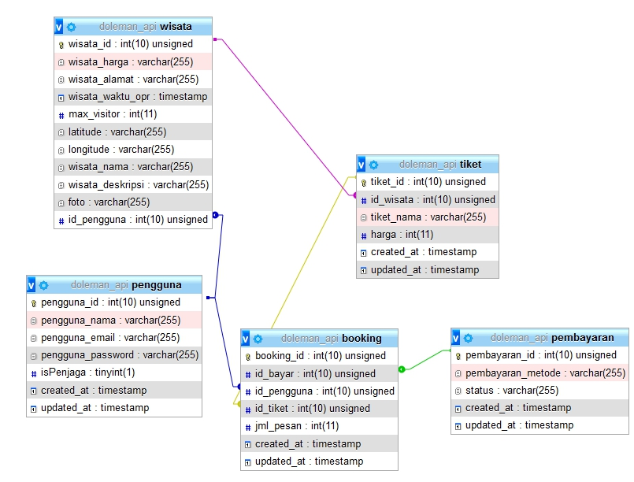

# doleman_backend
1. Membuat API dengan laravel  
https://medium.com/@tedoharischandra29/membangun-dan-testing-rest-api-dengan-crud-sederhana-laravel-687a7d96ab3b

2. Membuat migration dengan laravel  
https://www.malasngoding.com/migration-laravel/

3. Table structure  
